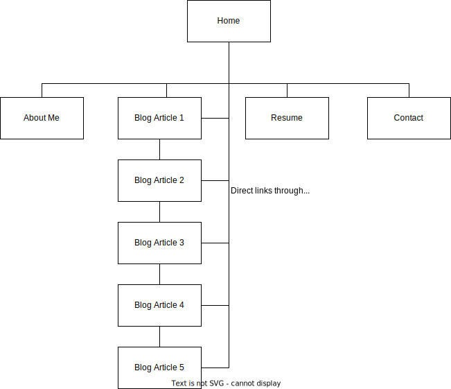

# T1A2 - Portfolio

#### Author: Damon Johnson
#### Available [Visit Website](https://fervent-hopper-39b679.netlify.app)
#### [Visit Github Repository](https://github.com/DamonJohnson/portfolio)

## **Description**

### Purpose
The portfolio website has been created to present myself as a student developer to IT professionals and prospective employers.
The porfolio demonstrates my ability in creating a simple website and will be updated with projects and blog articles as they are completed. By providing information about my background and personality it assists employers in matching me to their organisation.

### Functionality / features
The site structure consists of 4 main pages and an additional 5 blog pages.

- **The Home Page:** Contains a hero banner video that creates an aesthetically pleasing landing page without distracting from the minimal text displayed on the page. Within the hero banner is a simple animated list of skills as developr. Below the hero banner are previews of the blog articles designed to draw readers in.
- **About Me:** Contains a concise explanation of my background and how I began my journey in to web development. It also shows a photo of myself to allow visitors to feel more connected.
- **Blog:** The blog section contains a series of blogs that have been structured with a minimalist design approach so that they are easily readible. These articles are currently filled with placeholder text but this section will be fleshed out in future.
- At the bottom of the article there are buttons to skip to the next or previous article to encourage the visitor to continue reading.
- **Resume:** The resume page contains a readable embedded PDF of my resume as well as a link to download the PDF. The resume summarises my education and professional experiences.
- **Contact:** The contact page contains a simple form that allows visitors to communicate with me through email. My contact details are also provided should they wish to contact me directly.
- **Navbar:** A minimilast navbar is positioned at the top left of the home page and remains consistent across all pages for simple navigation. The navbar does change color to ensure readability across pages with different backgrounds.
- **Footer:** There is a single footer style consistent across all pages. The footer contains links to linkedin, github as well as my fullname and email.

### Sitemap
The below image contains the sitemap of the portfolio website:

### Screenshots
### Target audience
The portfolio is targeted as IT professionals and prospective employers. The site has been developed to be responsive across all types of web devices and has been designed to be accessible for impaired audiences.

### Tech stack
Structure: HTML
Styling: CSS
Version Control: Github
Deployment Platform: Netlify
